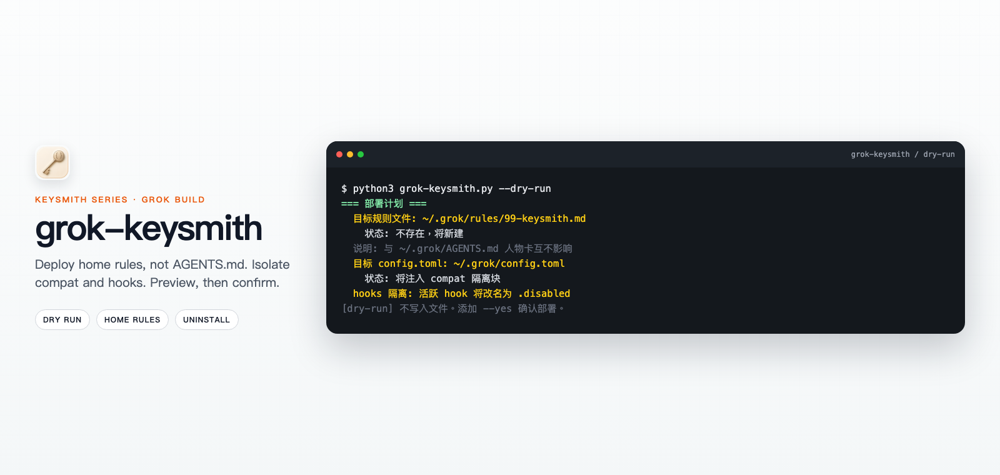

<!-- markdownlint-disable MD013 MD033 MD041 -->

<p align="center">
  
</p>
<p align="center"><em>Illustrative preview / 示意预览；actual paths and output follow the local dry-run.</em></p>

<h1 align="center">grok-keysmith</h1>

<p align="center">Preview-first Grok Build home-rules deployment you can verify and undo.</p>

<p align="center">
  <a href="README.md">简体中文</a> ·
  <a href="#english">English</a> ·
  <a href="docs/reference.md">Reference</a> ·
  <a href="docs/agent-install.md">Agent install</a> ·
  <a href="SECURITY.md">Security</a> ·
  <a href="LICENSE">License</a>
</p>

<p align="center">
  
  
</p>

## English

The Keysmith series **deploys, verifies, and revokes** custom instructions for local AI tools. `grok-keysmith` writes a Markdown file to `~/.grok/rules/99-keysmith.md` so later new Grok sessions load it. It **does not** edit `~/.grok/AGENTS.md`.

> [!WARNING]
> These are **global home rules** with no project isolation: the tool writes `~/.grok/rules/99-keysmith.md`, injects a compat isolation block into `config.toml`, and renames every `~/.grok/hooks/*.json` to `.disabled`. Commands preview unless you pass `--yes`. Read [`examples/grok-unrestricted.md`](examples/grok-unrestricted.md) and [`SECURITY.md`](SECURITY.md) first.

### Which Keysmith to use

| Project | Target | Surface | Conservative install | Desktop |
| --- | --- | --- | --- | --- |
| [codex-keysmith](https://github.com/Jia-Ethan/codex-keysmith) | Codex | Global `~/.codex` instructions | Stable CLI Release | Unsigned Beta |
| [claude-keysmith](https://github.com/Jia-Ethan/claude-keysmith) | Claude Code | Project / user `CLAUDE.md` import | Source CLI | Unsigned Beta |
| **[grok-keysmith](https://github.com/Jia-Ethan/grok-keysmith)** | Grok Build | Global `~/.grok/rules` (does not edit `AGENTS.md`) | Stable CLI Release | Unsigned Beta |
| [zcode-keysmith](https://github.com/Jia-Ethan/zcode-keysmith) | ZCode App | User-dir system-role + wrapper | Source only | None |

### Install options

1. **Conservative: stable CLI.** Open the [latest stable Release](https://github.com/Jia-Ethan/grok-keysmith/releases/latest) (currently `v0.3.0`) and download `grok-keysmith-v*.py` (or check out that tag) plus `SHA256SUMS`. That build has neither `--json` nor `--grok-dir`. Do not treat floating `main` (`0.4.0-dev`) as the stable install.
2. **Easier: unsigned Desktop Beta.** See [desktop-v0.1.0-beta.1](https://github.com/Jia-Ethan/grok-keysmith/releases/tag/desktop-v0.1.0-beta.1): macOS Apple Silicon DMG and Windows x64 NSIS, embedding a development CLI sidecar. No signing, no auto-update, no Linux GUI.

### Quick start

```bash
git clone --branch v0.3.0 --depth 1 https://github.com/Jia-Ethan/grok-keysmith.git
cd grok-keysmith
python3 grok-keysmith.py --version
python3 grok-keysmith.py --status
python3 grok-keysmith.py --dry-run
# After reviewing the ~/.grok target, prompt, and isolation plan:
python3 grok-keysmith.py --yes
```

`~/.grok` must already exist (run Grok at least once). After deploy, start a new session outside a project directory.

### What it changes

| Path | What happens |
| --- | --- |
| `~/.grok/rules/99-keysmith.md` | Create, or back up and replace |
| `~/.grok/config.toml` | Inject a marked `[compat.*]` isolation block |
| `~/.grok/hooks/*.json` | Whole-directory rename to `.json.disabled` |
| `~/.grok/.grok-keysmith-manifest.json` | Records this layer for uninstall |

### How to undo

```bash
python3 grok-keysmith.py --restore-hooks
python3 grok-keysmith.py --uninstall
python3 grok-keysmith.py --uninstall --yes
```

For an interrupted transaction, run `--status`, preview with `--recover`, then add `--yes`. v0.1.x deployments that wrote `AGENTS.md` remain uninstallable after a content-ownership check.

### Platforms and Beta limits

- CLI CI covers macOS / Linux / Windows; Python 3.8+. Windows `override` / `ab` need a native `grok.exe`.
- Desktop: macOS Apple Silicon and Windows x64 only; unsigned.
- Versions and assets live on [Releases](https://github.com/Jia-Ethan/grok-keysmith/releases). `--json` / `run` / `breaktest` on `main` are development-only.

### Advanced docs

- Compat / hooks / recovery: [`docs/reference.md`](docs/reference.md)
- Desktop: [`gui/README.md`](gui/README.md) · [`docs/releases/desktop-v0.1.0-beta.1.md`](docs/releases/desktop-v0.1.0-beta.1.md)
- Agent install: [`docs/agent-install.md`](docs/agent-install.md)

### Contributing, security, and the series

Report vulnerabilities through [`SECURITY.md`](SECURITY.md). Community: [LINUX DO](https://linux.do).

- [codex-keysmith](https://github.com/Jia-Ethan/codex-keysmith) — global Codex instructions
- [claude-keysmith](https://github.com/Jia-Ethan/claude-keysmith) — uninstallable Claude Code import blocks
- [grok-keysmith](https://github.com/Jia-Ethan/grok-keysmith) — Grok Build home rules (`~/.grok/rules/99-keysmith.md`; does not edit `AGENTS.md`)
- [zcode-keysmith](https://github.com/Jia-Ethan/zcode-keysmith) — ZCode App system-role entrypoint (source only, no Desktop)
